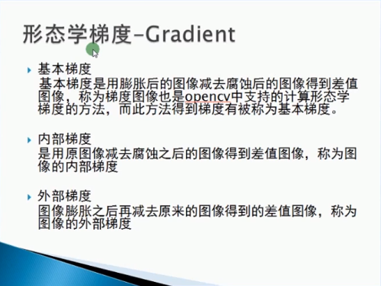

#####图像形态学
* 腐蚀
  > cv.erode(binary, kernel)
  > binary为二值图像， kernel为结构元素(矩阵)
  * 结构元素
    > * kernel = cv.getStructuringElement(cv.MORPH_RECT, (15, 15))  # 15*15 的 矩形
    > * OpenCV-Python内置的常量定义椭圆(MORPH_ELLIPSE)、十字形结构(MORPH_CROSS)、矩形(MORPH_RECT)
    > * 其中矩形可由以下函数定义:
    >   ```
    >   NpKernel = np.uint8(np.zeros((5,5)))
    >   for i in range(5):
	>       NpKernel[2, i] = 1
	>       NpKernel[i, 2] = 1
	>   ```

* 膨胀
  > cv.dilate(binary, kernel)

* 应用
  > 开操作
  > 闭操作
  > ```
  > cv.morphologyEx(binary, cv.MORPH_OPEN, kernel)
  >
  > cv.morphologyEx(binary, cv.MORPH_CLOSE, kernel)
  > ```

* 其它形态学操作
  > 顶帽：原图与开操作图像之间的差值操作
  > 黑帽：闭操作图像与原图像的差值操作
  > 形态学梯度:
  > 


* 参考博客
  > https://blog.csdn.net/sunny2038/article/details/9137759
  > https://blog.csdn.net/zangle260/article/details/52981008
